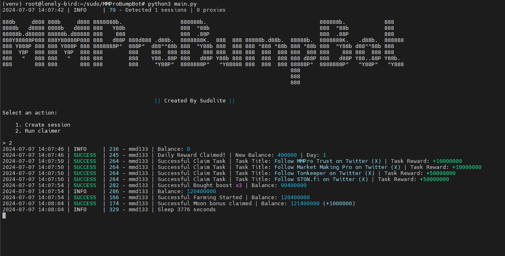

[](https://t.me/SudoLite)



> 🇮🇷 README available in Persian [here](README-FA.md)

## Functionality
| Functional                                                     | Supported |
|----------------------------------------------------------------|:---------:|
| Multithreading                                                 |     ✅     |
| Binding a proxy to a session                                   |     ✅     |
| Auto get all tasks except telegram tasks                       |     ✅     |
| Auto upgrade level for boost farming                           |     ✅     |
| Auto get daily reward                                          |     ✅     |
| Auto start farming and finish farming                          |     ✅     |
| Auto get moon bouns                                            |     ✅     |
| Support tdata / pyrogram .session / telethon .session          |     ✅     |

## [Settings](https://github.com/SudoLite/MMProBumpBot/blob/main/.env-example)
| Setting                    | Description                                                                   |
|----------------------------|-------------------------------------------------------------------------------|
| **API_ID / API_HASH**      | Platform data from which to launch a Telegram session (stock - Android)       |
| **AUTO_BUY_BOOST**         | Should I buy boost for farming _(True / False)_                               |
| **AUTO_CLAIM_TASKS**       | Should I claim tasks _(True / False)_                                         |
| **AUTO_CLAIM_MOON_BOUNS**  | Should I claim moon bouns _(True / False)_                                    |
| **SLEEP_BETWEEN_CLAIM**    | Random delay between **Claim** in seconds _(eg [3600,5000])_                  |
| **TAPS_COUNT**             | Random number of taps _(eg [45000,99000])_                                    |
| **DEFAULT_BOOST**          | Default boost name to buy _(eg x3)_                                           |
| **USE_PROXY_FROM_FILE**    | Whether to use proxy from the `bot/config/proxies.txt` file (True / False)    |

## Installation
You can download the [**Repository**](https://github.com/SudoLite/MMProBumpBot) by cloning it to your system and installing the necessary dependencies:
```shell
~ >>> git clone https://github.com/SudoLite/MMProBumpBot.git
~ >>> cd MMProBumpBot

# If you are using Telethon sessions, then clone the "converter" branch
~ >>> git clone https://github.com/SudoLite/MMProBumpBot.git -b converter
~ >>> cd MMProBumpBot

#Linux
~/MMProBumpBot >>> python3 -m venv venv
~/MMProBumpBot >>> source venv/bin/activate
~/MMProBumpBot >>> pip3 install -r requirements.txt
~/MMProBumpBot >>> cp .env-example .env
~/MMProBumpBot >>> nano .env # Here you must specify your API_ID and API_HASH, the rest is taken by default
~/MMProBumpBot >>> python3 main.py

#Windows
~/MMProBumpBot >>> python -m venv venv
~/MMProBumpBot >>> venv\Scripts\activate
~/MMProBumpBot >>> pip install -r requirements.txt
~/MMProBumpBot >>> copy .env-example .env
~/MMProBumpBot >>> # Specify your API_ID and API_HASH, the rest is taken by default
~/MMProBumpBot >>> python main.py
```

Also, for a quick launch, you can use arguments, for example:
```shell
~/MMProBumpBot >>> python3 main.py --action (1/2)
# Or
~/MMProBumpBot >>> python3 main.py -a (1/2)

#1 - Create session
#2 - Run clicker
```